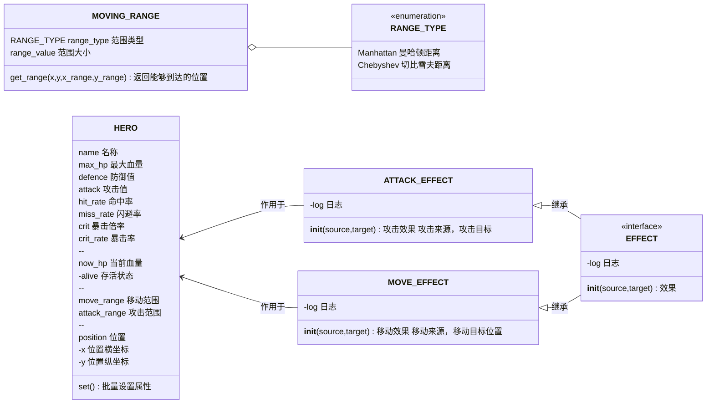
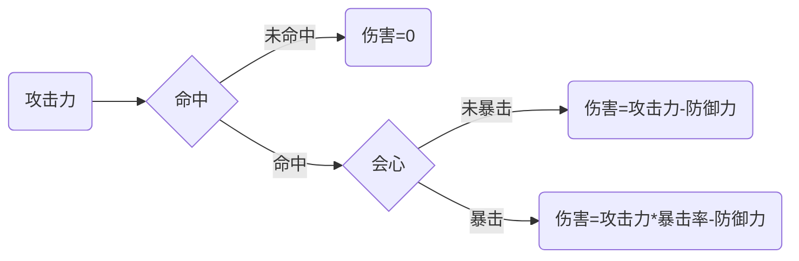

## 攻击效果

$$
\begin{align*}
damage = \begin{cases}
0 & p_{hit} > source.hit
\\
source.attack - target.defence & p_{hit} \leq source.hit_rate \land p_{crit} > source.crit_rate
\\
source.crit * source.attack - target.defence & p_{hit} \leq source.hit_rate \land p_{crit} \leq source.crit_rate
\end{cases}
\end{align*}
$$
